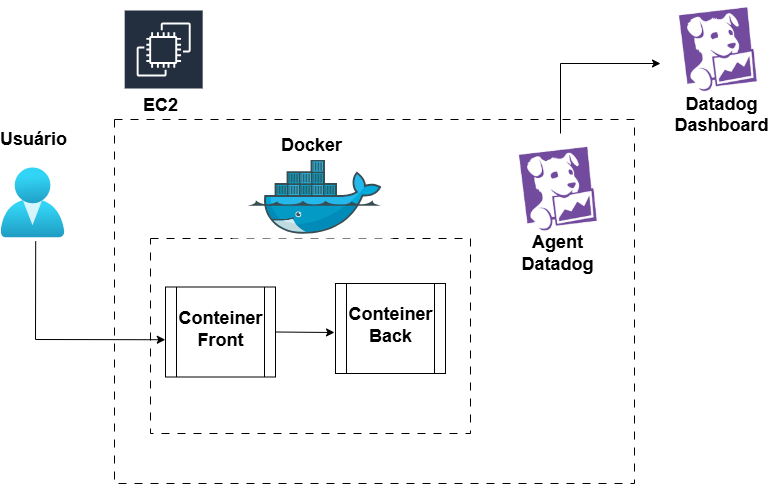
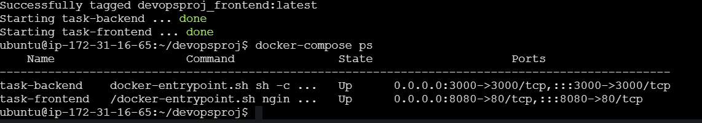
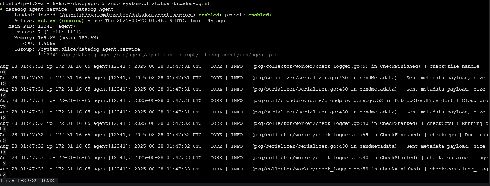
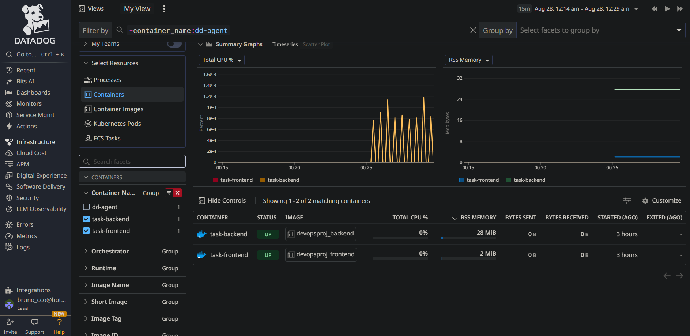
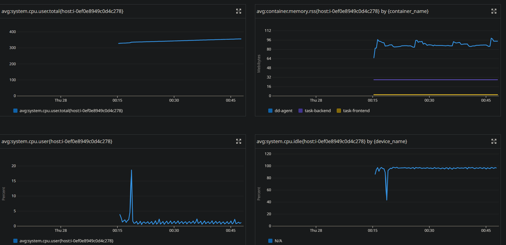

# 🚀 Projeto DevOps: Deploy com Docker + Monitoramento Datadog

## 📝 Descrição do Projeto
Este projeto foi desenvolvido com o objetivo de praticar conceitos de **DevOps** e **Observabilidade**, passando por todo o ciclo de criação de um ambiente na nuvem, deploy de containers e monitoramento em tempo real.  

🔹 O que foi feito:
- Criação de um servidor **EC2 (Ubuntu)** na AWS.  
- Deploy de containers **Frontend** e **Backend** utilizando **Docker Compose**, com banco de dados **SQLite embutido**.  
- Instalação e configuração do **Datadog Agent** para monitorar métricas de **host** e **containers**.  
- Análise e visualização de métricas de CPU, memória e disco no **Datadog Dashboard**.  

Este projeto agregou conhecimento em:
- Provisionamento de infraestrutura em nuvem.  
- Boas práticas de deploy com Docker.  
- Monitoramento e observabilidade com Datadog.  
- Diferenças entre métricas de host e métricas de containers.  

---

## 📝 Arquitetura visual do projeto



---

## 🛠️ Serviços Utilizados
- **AWS EC2** (Ubuntu Server 22.04 LTS)  
- **Docker & Docker Compose**  
- **Datadog Agent v7**  
- **SQLite** (banco embutido no backend)  

---

## 📁 Estrutura de Pastas
```bash
📁 devopsproj
│── docker-compose.yml
│── README.md
│── 📁 img 
│── 📁 backend       # Código do backend (API + SQLite)
│   │── app.js
│   └── Dockerfile
└── 📁 frontend      # Código do frontend
    │── app.js 
    │── index.html
    └── Dockerfile
```
---

## 📋 Requisitos para Execução

Antes de começar, você precisará ter:

- Conta ativa na AWS.  
- Criar uma instância EC2 Ubuntu na AWS e rodando.  
- Chave de acesso ou acesso via AWS Instance Connect.  
- Conta ativa no Datadog com API Key disponível.  

---

## 1️⃣ Criação do Servidor Ubuntu na AWS

Nesta etapa será criada a instância EC2 que hospedará a aplicação em containers.

### 🔹 Passos para criação da instância

1. Acesse o [console da AWS](https://console.aws.amazon.com/ec2).  
2. Clique em **Launch Instance**.  
3. Configure os seguintes pontos:

- **Name and tags**: Defina um nome identificador, ex: `devopsproj-ec2`.  
- **Amazon Machine Image (AMI)**: Escolha **Ubuntu Server 22.04 LTS (x86_64)**.  
- **Instance type**: Selecione `t2.micro` (free tier elegível).  
- **Key pair (login)**:  
  - Crie ou selecione um **Key Pair (chave SSH)**.  
  - Caso crie, baixe o arquivo `.pem` e guarde em local seguro (será necessário para acessar via SSH).  
- **Network settings**:  
  - Use a **VPC default**.  
  - Crie um **Security Group** com as seguintes regras:  

### 🔹 Inbound Rules

| Type        | Protocol | Port Range | Source Type | Source         | Descrição                                   |
|-------------|----------|------------|-------------|----------------|---------------------------------------------|
| SSH         | TCP      | 22         | My IP       | Seu IP público | Acesso seguro ao servidor via SSH           |
| HTTP        | TCP      | 80         | Anywhere    | 0.0.0.0/0      | Acesso web padrão (opcional)                |
| Custom TCP  | TCP      | 8080       | Anywhere    | 0.0.0.0/0      | Permitir acesso ao **frontend**             |
| Custom TCP  | TCP      | 3000       | Anywhere    | 0.0.0.0/0      | Permitir acesso ao **backend**              |

> ⚠️ **Recomendação de segurança**: sempre que possível, restrinja as portas (como `8080` e `3000`) ao **seu IP público** em vez de `0.0.0.0/0`, para evitar exposição indevida.

### 🔹 Outbound Rules:
Deixar padrão (**All traffic** permitido).

### 🔹 Storage: 
Manter configuração padrão de 8GB (pode ajustar se necessário).

- Clique em **Launch Instance**.

---

## 2️⃣ Como acessar a instância

Existem duas formas principais:

- **EC2 Instance Connect (Web no navegador)**: (Usado neste projeto)  
  Mais simples, não requer configuração de chave local.  
  Basta selecionar a instância no console, clicar em **Connect → EC2 Instance Connect → Connect**.

- **SSH Local (Terminal)**:  
  Usando o `.pem` baixado no momento da criação:
  ```bash
  chmod 400 devops-key.pem
  ssh -i "devops-key.pem" ubuntu@<IP_PÚBLICO_DA_INSTÂNCIA>
  ```

---

## 3️⃣ Preparação do servidor

Apesar de já vir atualizado, é recomendado rodar:

```bash
sudo apt update && sudo apt upgrade -y
```

Instalação do Docker:

```bash
sudo apt install docker.io -y
```

Instalação do Docker Compose:

```bash
sudo apt install docker-compose -y
```

---

## 4️⃣ Deploy e criação dos containers

Clonando o repositório:

```bash
git clone https://github.com/brunocco/devopsproj.git
cd devopsproj
```

Criando e executando os containers:

```bash
sudo docker-compose up -d --build
```

---

## 5️⃣ Instalação do Datadog Agent

Instalação do Agente v7 (para monitorar containers e host):

```bash
docker run -d --name dd-agent   -e DD_API_KEY=SEU_API_KEY   -e DD_SITE="us5.datadoghq.com"   -e DD_DOGSTATSD_NON_LOCAL_TRAFFIC=true   -v /var/run/docker.sock:/var/run/docker.sock:ro   -v /proc/:/host/proc/:ro   -v /sys/fs/cgroup/:/host/sys/fs/cgroup:ro   -v /var/lib/docker/containers:/var/lib/docker/containers:ro   gcr.io/datadoghq/agent:7
```
📌 Obs: A versão 7 já coleta métricas tanto do host quanto dos containers.

---

## 📊 Observabilidade com Datadog

Após instalar o agente, as métricas podem ser acessadas no Dashboard do Datadog:
- Menu **Metrics Explorer** → buscar métricas.  
- Menu **Infrastructure** → visualizar containers e host.  

📌 Obs: Aguarde em terno de 5 minutos para ficar mais visual os deshboards.

### 🔎 Métricas monitoradas neste projeto:

- `avg:system.cpu.user.total` → uso de CPU total do host.  
- `avg:container.memory.rss` → memória usada pelos containers.  
- `avg:system.cpu.user` → uso de CPU do usuário no host.  
- `avg:system.cpu.idle` → tempo ocioso da CPU do host.  
- `avg:system.disk.used` → disco usado no host.  
- `avg:system.disk.free` → espaço livre no disco.  

Essas métricas permitiram entender o comportamento dos containers em relação ao consumo de recursos do servidor.

---

## 📈 Observabilidade e Aprendizado

Este projeto reforçou conceitos de DevOps e Observabilidade, como:

- Deploy automatizado de containers.  
- Uso de Docker Compose para orquestração local.  
- Monitoramento de métricas em tempo real.  
- Coleta de métricas detalhadas de CPU, memória e disco.  
- Troubleshooting de containers e host.  
- Integração com Datadog para dashboards e alertas.  
- Diferenças práticas entre métricas de host e métricas de containers.  

---

## 🖼️ Extras (Prints do Dashboard)

## 1. Conteiners criados e rodando


## 2. Agente Datadog Rodando coletando metricas de CPU e Memória da EC2


## 3. Dashboard na Plataforma Datadog da CPU e Memória dos conteires Front e Back


## 4. Dashboard das metricas CPU total do Host, CPU do User Host, Tempo ocioso da CPU Host e Memória usada pelos conteiners


## 5. Dashboard das metricas Disco usado no host e Espaço livre no disco.


---

## 🔮 Próximos passos possíveis:

- Migrar para ECS (Fargate) para rodar containers serverless.  
- Automatizar provisionamento com Terraform.  
- Criar alertas customizados no Datadog para incidentes.  
- Integração com CI/CD (GitHub Actions ou GitLab CI).  

---

## 👤 Autor

- Feito por: **Bruno Cesar**  
- LinkedIn: [Acesse aqui](https://www.linkedin.com/in/bruno-cesar-704265223/) 
- Página do Projeto: [Meu Repositorio](https://medium.com/@brunosherlocked/projeto-devops-e-observabilidade-com-docker-aws-ec2-e-datadog-1b3dc6c6a19f)  

```
